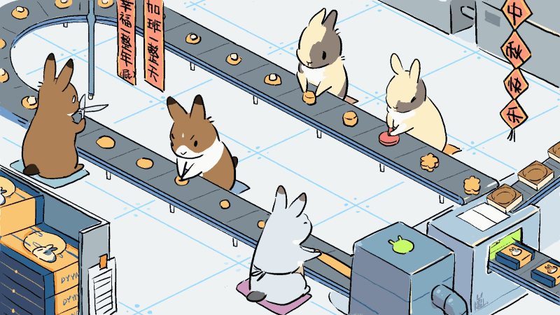

# Mooncake factory simulation

This project is a collection of scripts that mimic a "mooncake steamline":

- rabbit1 will produce dough
- rabbit2 will take the dough and make crust
- rabbit3 will produce the filling
- rabbit4 will take one crust and one filling and make a bun
- rabbit5 will press the bun and make it a cake
- machine1 will wrap the cake with a box



```
dough -> crust -+
                |
filling --------+-----> bun -> cake -> box
```

**The goal of them is to make 10000 mooncake!**

`/output` is the working directory, where inside it:
- `/dough` contains the rabbit1's output, like:
  - `/dough/d0000`: the first dough, the content of this file is the flavor, e.g. "spicy".
  - `/dough/d0001`: the second dough, the content may be "sweet".

- `/crust` contains the rabbit2's output, like:
  - `/crust/d0000`: the first crust made from the first dough, the content of this file is the same of the input, i.e. "spicy".

- `/filling` contains the rabbit3's output, like:
  - `/filling/f0000`: the first filling. The content is the fillings type, e.g. "lotus-seed".
  - `/filling/f0001`: the second filling, the content may be "potato".

- `/bun` contains the rabbit4's output, like:
  - `/bun/d0000f0001`: the first crust wrapping the second filling. The content is the combination of flavor and filling, i.e. "spicy potato".

- `/cake` contains the rabbit5's output, like:
  - `/cake/d0000f0001`: what the above bun was made into. The content should be "spicy potato".

- `/box` contains the final output, like:
  - `/box/b0000d0000f0001`: the first box, which wraps the above cake. The content is appended with the color of the box, e.g. "spicy potato with a red box".

The process of making the bun is time-consuming, so chances are the rabbit4 will need accompanies (scripts that runs in parallel).